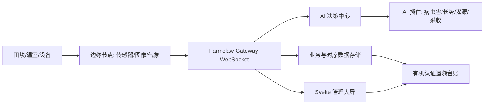

# 有机农业数字化种植管理 AI 系统开发方案

## 1. 方案定位

本方案基于《有机农业数字化种植 AI 项目立项报告-202401》和当前 Farmclaw 仓库现状调整。PDF 中项目目标包括种植全过程数字化监控、病虫害智能识别、生长环境调控、有机认证追溯；当前仓库已有 Python WebSocket 网关、边缘节点、AI 控制节点和 Svelte 大屏原型，适合作为低成本 MVP 的基础。

调整原则：

- 保留现有 Farmclaw 分布式控制面，不在首版重写为 Spring Cloud。
- 保留 Svelte Dashboard 作为首版 Web 管理端，不在首版并行开发 React Native。
- 先做“可信追溯台账 + 哈希存证”，不在首版引入 Hyperledger Fabric。
- AI 模型先采用可插拔接口、规则基线和样例模型，待真实数据积累后再训练或接入专用模型。
- 首版目标是可演示、可验收、可继续扩展，不承诺一次性交付完整生产级平台。

## 2. 当前能力与差距

当前已具备：

- `gateway/server.py`：WebSocket 中央网关，可注册节点、路由 RPC、广播观察事件。
- `nodes/base_node.py`：边缘节点基类，可注册传感器、气象等能力。
- `nodes/iot_node.py`、`nodes/weather_node.py`：模拟传感器与气象节点。
- `core/pi_agent.py`：基于规则的农业问答与工具调用中枢。
- `farmclaw-dashboard/`：Svelte 可视化大屏，可展示拓扑、聊天、RPC、遥测状态。
- `simulate.py`、`tests/test_flow.py`：基础模拟与联调测试入口。

主要差距：

- 缺少田块、作物、种植批次、农事任务、投入品、认证材料等业务数据模型。
- 缺少持久化存储，遥测和操作记录当前主要是实时流。
- 病虫害识别、长势评估、灌溉/施肥建议、采收预测还没有模块化接口。
- 有机认证追溯只在立项目标中出现，代码层没有追溯台账、二维码或批次档案。
- Dashboard 偏控制面展示，缺少生产管理、预警、追溯和验收视图。

## 3. 调整后的总体架构

首版沿用“Gateway + Nodes + AI Brain + Dashboard”的结构，只增加业务层和存储边界：

- 网关层：继续承担节点注册、RPC 路由和实时事件广播。
- 边缘层：扩展传感器、图像采集、无人机/摄像头模拟节点。
- AI 层：将当前 `pi_agent.py` 的规则判断拆成可测试的决策服务，逐步接入模型。
- 数据层：新增作物批次、田块、遥测、农事操作、投入品和追溯事件。
- 展示层：Dashboard 从“系统拓扑大屏”扩展为“生产监控 + AI 建议 + 追溯验收”。

## 4. 核心模块

### 4.1 智能监测模块

目标：采集土壤、气象、光照、作物图像等多源数据，形成田块实时状态。

开发内容：

- 扩展 `sensor.read_data` 支持温度、湿度、土壤水分、pH、光照、EC 等指标。
- 新增 `image.capture` / `crop.image_upload` 图像采集接口，用于病虫害和长势识别。
- 新增遥测数据标准结构：`field_id`、`crop_batch_id`、`metric`、`value`、`unit`、`captured_at`、`source_node`。
- Dashboard 增加田块卡片、指标曲线、异常状态和设备在线状态。

### 4.2 AI 决策中心

目标：先用规则和轻量模型形成可解释建议，再替换为专用模型。

开发内容：

- 将 `core/pi_agent.py` 中的自然语言判断和工具调用拆分为独立 decision service。
- 新增四类 AI 能力接口：
  - `ai.crop_growth_assess`：作物长势状态评估。
  - `ai.pest_diagnose`：病虫害识别与生态防治建议。
  - `ai.irrigation_recommend`：灌溉优化建议。
  - `ai.harvest_predict`：采收期预测。
- 每条 AI 建议必须包含依据、置信度、建议动作和人工确认状态。
- 首版不直接自动控制设备，只生成建议和操作提醒，避免误操作风险。

### 4.3 种植管理平台

目标：把“种植全过程数字化管理”落成可录入、可查询、可追溯的业务流程。

开发内容：

- 田块/温室档案：位置、面积、土壤、传感器绑定。
- 作物批次：品种、播种日期、预计采收期、有机认证状态。
- 种植计划：播种、育苗、移栽、灌溉、施肥、巡检、采收。
- 农事操作记录：人员、时间、田块、作物批次、操作类型、照片/附件。
- 投入品管理：有机肥、生物农药、种子、供应商、批号、使用记录。
- 任务提醒：基于作物阶段和 AI 建议生成待办。

### 4.4 有机认证追溯模块

目标：先满足单项目验收和消费者信任展示，再预留多方链上存证能力。

开发内容：

- 建立批次追溯台账：从种植计划、投入品、农事操作、监测数据到采收记录。
- 为每个采收批次生成追溯二维码，展示批次档案、关键农事记录、检测/认证材料。
- 对关键追溯事件生成哈希摘要，形成不可随意篡改的本地存证链。
- 首版不接入 Hyperledger Fabric；若后续涉及监管、认证机构或多企业协同，再升级为联盟链。

## 5. 技术栈决策

首版建议：

- 后端：继续使用 Python WebSocket 服务，补充模块化 service 和 repository 层。
- 前端：继续使用 Svelte + Vite，围绕现有 Dashboard 扩展业务视图。
- 数据库：开发期可用 SQLite；验收/生产建议迁移到 PostgreSQL + TimescaleDB。
- AI：首版使用规则基线 + 可插拔模型适配器；图像识别可先接入外部模型或离线分类器。
- 追溯：首版使用数据库事件表 + 哈希链；暂不引入 Fabric。

不建议首版投入：

- Spring Cloud 微服务重构：当前团队和预算下会放大交付风险。
- React Native 移动端：先用响应式 Web 满足管理和验收场景。
- 区块链平台：在没有多方共识、监管接口和链上验收要求前，成本高于收益。

## 6. 里程碑计划

| 阶段 | 周期 | 目标 | 交付物 |
| --- | --- | --- | --- |
| P0 方案冻结 | 第 1 周 | 明确 MVP 边界、数据模型、验收指标 | 开发方案、数据模型草案、接口清单 |
| P1 数据底座 | 第 2-3 周 | 建立田块、作物批次、遥测、农事记录 | 数据模型、基础 API/节点接口、种植档案页面 |
| P2 监测大屏 | 第 4-5 周 | 完成环境监测、设备拓扑、异常预警展示 | Dashboard 监测视图、模拟数据联调 |
| P3 AI 建议 | 第 6-8 周 | 完成病虫害、灌溉、施肥、采收预测的规则/模型接口 | AI 建议服务、建议记录、人工确认流程 |
| P4 追溯验收 | 第 9-10 周 | 完成批次台账、投入品记录、二维码追溯 | 追溯页面、批次二维码、哈希存证 |
| P5 联调发布 | 第 11-12 周 | 完成系统测试、演示脚本、验收材料 | 测试报告、演示数据、部署说明 |

如果严格对应 PDF 的 2024.01-2024.04：

- 1 月：方案设计、数据模型、接口与原型冻结。
- 2 月：源代码开发、监测节点、Dashboard、种植管理基础流程。
- 3 月：AI 决策接口、病虫害/灌溉/采收预测、追溯台账。
- 4 月：系统联测、检测、产品验收和发布。

## 7. 验收标准

最低可验收版本应满足：

- 至少配置 2 个田块/温室、2 个作物批次、5 类传感指标。
- Dashboard 能实时显示节点在线、遥测数据、异常预警和 AI 建议。
- 支持录入完整农事记录和投入品记录，并关联到作物批次。
- 支持上传作物图片并返回病虫害/长势诊断结果或占位模型结果。
- 支持生成采收批次追溯二维码，消费者页面可查看关键记录。
- AI 建议具备依据、置信度、人工确认状态，不能无确认直接执行控制。
- 提供一键模拟脚本，能稳定跑通“采集-判断-建议-记录-追溯”闭环。

## 8. 测试与验证

建议测试层级：

- 单元测试：数据模型、AI 规则、追溯哈希、节点技能函数。
- 集成测试：Gateway 路由、节点注册、RPC 调用、AI 建议生成。
- 前端构建：`npm run build` 验证 Dashboard 可构建。
- 演示联调：启动网关、传感器节点、气象节点、AI 节点和 Dashboard，执行模拟脚本。
- 验收脚本：固定一组作物批次数据，跑通追溯二维码和 AI 建议闭环。

## 9. 风险与回滚

| 风险 | 影响 | 控制方式 |
| --- | --- | --- |
| AI 数据不足 | 诊断准确率无法保证 | 首版标注为辅助建议，保留规则基线和人工确认 |
| 真实硬件不可用 | 联调延期 | 使用模拟节点和标准接口，硬件后续替换节点实现 |
| 追溯要求变化 | 区块链/监管接口返工 | 首版抽象事件台账接口，Fabric 作为后续适配器 |
| 范围过大 | 4 个月无法稳定验收 | 首版只做 Web 管理端和核心闭环，移动端/联盟链后置 |
| 数据模型不稳定 | 后续迁移成本高 | P0 先冻结田块、批次、投入品、农事、追溯事件核心模型 |

回滚策略：

- AI 模块异常时降级为规则建议和人工录入。
- 数据库迁移异常时保留 JSON/SQLite 演示数据和导入脚本。
- 前端业务页面未完成时，保留现有系统拓扑大屏作为演示入口。
- 追溯二维码不可用时，先提供批次详情页面链接和导出报告。

## 10. 下一步执行建议

优先拆成 5 个开发任务：

1. 数据模型与持久化底座：田块、作物批次、遥测、农事、投入品、追溯事件。
2. 监测节点扩展：统一传感器指标结构，补充图像采集模拟节点。
3. AI 决策服务：拆分 `pi_agent.py`，实现可测试的建议生成接口。
4. Dashboard 业务视图：新增田块、预警、AI 建议、批次追溯页面。
5. 联调与验收脚本：固定演示数据，跑通完整闭环并形成验收材料。
