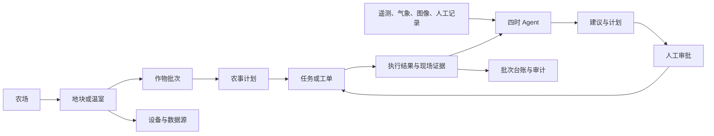

# 四时农业 Agent 前端功能审查与汇报方案

日期：2026-09-02
审查对象：`farmclaw-dashboard` 当前工作区版本
产品新名称：四时
产品定位假设：面向农场生产经营者的农业 Agent，而非单纯数字孪生大屏

## 一、汇报结论

当前前端已经具备较好的数字孪生展示底座，包括地图、遥测、安防、预警、资源与设备看板、AI 托管、审批护栏和大屏模式。视觉完成度较高，演示边界也表达得相对诚实。

但从“农业 Agent”定位看，当前产品仍然更接近“带 AI 模块的数字农场驾驶舱”，而不是“能持续理解农场、规划农事、协调人和设备、验证结果并积累经验的农业 Agent”。最核心的缺口不是再加一张数据看板，而是把前端主线从“切换六个专题看状态”重构为“发现问题、生成计划、人工确认、执行协同、结果验证、沉淀台账”的闭环。

建议把下一阶段前端目标定义为：

> 四时不是一个会回答农业问题的聊天框，而是一个以农场真实对象和生产周期为上下文，能够给出有依据的计划、推动任务落地、追踪结果并接受审计的农业生产 Agent。

### 一句话判断

- 演示能力：已形成。
- 监测与可视化：已形成基础。
- AI 建议与安全护栏：部分形成。
- 农业 Agent 交互：尚未形成主体验。
- 农事生产闭环：尚未形成。
- 真实数据、权限、持久化和执行验证：尚未形成。
- “四时”品牌与“农业 Agent”定位：尚未进入现有界面。

## 二、审查范围与证据

本次审查基于以下证据：

1. 项目产品与设计文档：`PRODUCT.md`、`DESIGN.md`、`docs/organic-ai-development-plan.md`。
2. 前端路由、主视图、HUD、AI 托管、安防、预警、运营、产值预测和 WebSocket 桥接实现。
3. 真实页面检查：桌面端 `1280 × 720`，移动端 `390 × 844`。
4. 现有验证：13 项前端专项校验全部通过，生产构建通过。
5. 构建结果：两个主要异步包约为 1.09 MB 和 1.39 MB，仍有大包警告。
6. 外部政策与公开产品资料，用于判断农业 Agent 的基本能力边界和“首个”宣传风险。

本报告评估的是当前工作区中可见、可操作、可验证的能力。文档中的未来规划不计为已交付功能。

### 交付物

- 本审查报告：`docs/project/2026-09-02-sishi-frontend-function-audit-report.md`
- 逐页汇报稿：`docs/project/2026-09-02-sishi-report-deck.md`
- 信息架构包：`docs/ia/`

### 证据索引

| 文件 | 本次使用的事实 |
| --- | --- |
| `farmclaw-dashboard/src/router/index.js` | 当前只有 `/index` 主路由，其他地图路由仍为注释示例 |
| `farmclaw-dashboard/src/components/FarmclawHud.vue` | 六个专题、系统事件、地图工具、底部 Agent 输入、移动端布局和大屏模式 |
| `farmclaw-dashboard/src/composables/useFarmclawBridge.js` | WebSocket observer、重连、内存事件流、指令发送和 `uploaded:false` 附件元数据 |
| `farmclaw-dashboard/src/composables/useAiManaged.js` | 三种托管模式、Dry Run、范围、审批、紧急停止和前端内存审计 |
| `farmclaw-dashboard/src/components/SecurityPanel.vue` | 安防点位和围栏的本地演示语义 |
| `farmclaw-dashboard/src/components/OperationsPanel.vue` | 资源与设备看板的只读、演示基线语义 |
| `farmclaw-dashboard/src/components/AlertCenterPanel.vue` | 气候与虫害预警的演示数据边界 |
| `docs/organic-ai-development-plan.md` | 田块、批次、农事、投入品、追溯和 AI 决策服务仍属于规划目标 |

## 三、当前前端已具备的能力

### 3.1 数字孪生与空间可视化

- OpenFreeMap + MapLibre 默认地图，可切换卫星图。
- 农田、水产、温室、设施、农机、安防、预警、产值等专题图层。
- 地图标注、缩放分级、点位详情、安防聚焦、农机状态与方向、无人机模拟巡航。
- 生产、安防、AI、产值、运营、预警六个专题可与地图联动。

### 3.2 生产与风险展示

- 温度、土壤水分、空气湿度、光照、pH 五类遥测。
- 作物、批次、生长阶段、阶段进度和生产健康摘要。
- 气候与虫害预警、风险等级、置信度、影响范围和建议。
- 水、电、肥液、农药消耗看板，以及设施设备状态目录。
- 独立农机监测清单，支持五类运行状态、任务进度、速度、能源、工时、维护、异常和地图双向定位；当前数据明确标记为演示遥测。

### 3.3 AI 托管与安全边界

- 观察、辅助托管、自动托管三种模式。
- AI 任务包含原因、证据、建议动作、对象、风险、置信度和来源版本。
- 中高风险人工审批、Dry Run、紧急停止、范围白名单和审计记录。
- 模型与知识库配置入口，未配置能力不会伪装成可用。

### 3.4 展示与适配

- 专门的大屏展示模式。
- 桌面和移动端均能完成主要专题切换。
- 状态不完全依赖颜色，已经有文字、形状和可访问标签的基础。

这些能力说明当前项目不是空原型。它已经具备成为农业 Agent “感知层”和“运营工作台底座”的条件。

## 四、核心不足与优先级

### P0：定位与核心闭环问题

| 缺口 | 当前证据 | 影响 | 建议 |
| --- | --- | --- | --- |
| “四时”与农业 Agent 定位未进入产品 | 页面标题、浏览器标题和设计系统仍为 Farmclaw 或“数字孪生智慧农场”；Agent 只位于底部输入栏 | 用户第一眼会把产品理解为大屏，不会理解 Agent 的独特价值 | 建立“四时”品牌层级，首屏明确展示今日判断、行动计划和 Agent 状态，地图降为重要工作视图之一 |
| Agent 不是主工作区 | 输入内容只发送到网关并写入默认收起的系统事件；没有可见对话线程、回复卡片、引用、步骤、工具调用和结果 | 用户无法连续追问，也无法理解 Agent 做了什么、为什么做、做到哪一步 | 新增 Agent 工作台：会话、目标、计划、证据、审批、执行进度、结果和追问一体化 |
| 没有真实农业对象导航 | 只有 `/index` 单一路由；没有农场、地块、温室、批次、设备和人员的可选择对象层级 | 所有信息被压在同一张地图上，无法支持多农场、多田块和长期运营 | 建立“农场 > 地块/温室 > 作物批次 > 任务/记录/设备”的对象模型和详情页 |
| 当前田块不是用户主动选择 | `activeField` 会被最新遥测消息改写，页面没有稳定的田块选择器 | 新消息可能让用户上下文漂移，审批对象与查看对象容易不一致 | 将查看范围改为用户显式选择；实时消息只提示“其他地块有更新”，不自动切换上下文 |
| 缺少农事任务闭环 | 有 AI 建议和“提交”状态，但没有责任人、计划时间、工单、现场完成、照片、复核和效果评估 | 无法证明 Agent 产生了实际生产价值 | 建立“建议 > 审批 > 派单 > 执行 > 现场反馈 > AI 验证 > 归档”流程 |
| 缺少真实告警闭环 | 预警主要是展示和筛选，没有统一的确认、分派、升级、关闭、误报和复盘状态 | 告警数量无法转化为处置效率 | 所有预警统一进入事件中心，支持负责人、SLA、处置步骤、证据和关闭原因 |
| 状态只在前端内存 | AI 托管、安防状态和审计刷新后重置，事件最多保留 12 条 | 无法用于交接班、审计、追责和模型效果评估 | 持久化任务、审批、告警、审计、会话和执行结果，前端显示来源与同步状态 |
| 缺少身份、角色和权限 | 当前没有登录、角色、操作范围和高风险权限模型 | 自动托管、安防和设备控制无法进入生产环境 | 至少建立管理员、生产负责人、农艺师、值守人员、巡检人员、只读访客六类角色 |
| 追溯与合规仍停留在文档 | 现有界面没有农事记录、投入品台账、有机认证材料、采收批次和追溯二维码页面 | 无法完成有机农业项目原定的业务验收和信任闭环 | 将“台账”作为一级产品能力，所有 Agent 动作自动形成可追溯事件 |

### P1：信息架构与交互效率问题

| 缺口 | 当前证据 | 影响 | 建议 |
| --- | --- | --- | --- |
| 地图成为整个业务入口的技术门槛 | 六个专题按钮在地图未就绪时全部禁用，但页面提示又称控制面可独立使用 | 地图或瓦片服务异常时，任务、告警和 AI 工作也被阻断 | 业务路由与地图初始化解耦；地图失败只影响地图视图 |
| 六个专题混合了对象、任务和分析 | “生产态势、安防、AI、产值、运营、预警”同级，组织原则不统一 | 新功能继续加入后会形成横向标签堆积 | 一级导航改为今日、农场、作业、智能、台账，专题成为各对象内的视图或筛选 |
| 页面不可分享和恢复 | 所有专题、筛选、田块都在同一路由的临时状态中 | 无法收藏、分享、返回，也无法把某个告警链接发给同事 | 为地块、任务、告警、批次、设备、会话建立独立 URL |
| 系统事件噪声高 | 断网重连时，AI 评估会反复写入事件流；本次检查中约 35 秒内最后 12 条全部是相同的 `AI.EVALUATED` | 真正的告警和用户操作会被淹没 | 相同事件聚合计数，增加级别、来源、对象、负责人和未读筛选；技术日志与业务事件分离 |
| 离线状态下存在语义冲突 | 顶部显示“网关不可用”，AI 任务原因仍可能写“网关在线，但未发现节点” | 直接损害 Agent 的可信度 | 所有文案必须从同一个状态模型生成；冲突状态进入显式诊断视图 |
| 预警与 AI 建议缺少历史趋势 | 当前主要基于单次快照或静态演示基线，没有同比、环比、趋势、预测区间和结果回看 | 用户知道“现在有问题”，但无法判断变化速度与处置效果 | 增加 24 小时、7 天、批次周期趋势，以及动作前后对比 |
| 产值预测缺少决策解释 | 当前为 0-100 演示指数，尚无价格、成本、产量、订单或模型区间 | 容易被误读为真实产值，难以支持经营决策 | 拆为产量预测、价格情景、成本预算和毛利区间，并展示数据时间、方法与误差 |
| 缺少全局搜索和最近对象 | 无法按地块、批次、设备、告警、工单或会话检索 | 多对象后查找成本会快速上升 | 增加全局搜索、最近访问、收藏和快捷命令 |

### P1：移动现场作业问题

- 当前移动端把顶部状态、地图、专题分析、横向专题栏和 Agent 输入同时叠在一个屏幕中。可用，但每层都偏紧。
- `390px` 宽度下，专题栏可视宽度约 `370px`，内容宽度约 `590px`，后两个入口依赖横向滚动发现。
- 生产检查等关键文字实测为 `9px`，低于项目自己设定的关键正文 `12px` 下限，在户外强光和移动场景下可读性不足。
- 移动端没有现场拍照上传、语音输入、定位打点、扫码、离线任务和断点续传，这些才是巡检人员的高频能力。

建议移动端不要简单缩小驾驶舱，而要切换为“现场任务模式”：

1. 首页只保留今日任务、紧急告警和语音唤起。
2. 地图、任务、扫码、拍照四类操作做成底部主导航。
3. 现场任务支持离线填写、图片压缩、定位、时间水印和恢复上传。
4. 复杂分析与模型配置保留在桌面端。

### P2：长期产品化问题

- 缺少初次接入向导：农场建档、地块导入、传感器绑定、数据校验和知识库配置。
- 缺少数据源健康中心：来源、更新时间、延迟、缺失率、异常率和校准状态。
- 缺少通知中心：短信、企业微信、电话、站内通知和升级策略。
- 缺少报告与导出：日报、周报、批次报告、投入品记录、认证材料和经营复盘。
- 缺少多农场、多组织、跨区域对比和总部视图。
- 缺少 Agent 反馈学习：采纳、修改、拒绝、执行结果、误报和效果标签。
- 缺少低网速、断网、设备时钟漂移、重复消息、数据补传等现场异常设计。
- 前端核心文件和地图包偏大，后续功能继续叠加会影响首屏加载和低端设备稳定性。

## 五、目标信息架构

### 5.1 信息架构原则

采用“任务优先，农业对象承载上下文”的组织方式：

1. 用户先看今天要处理什么。
2. 每个任务都明确属于哪个农场、地块、批次或设备。
3. 地图是空间工作视图，不是所有功能的唯一入口。
4. AI 的建议、审批、执行和结果始终在同一条任务时间线上。
5. 所有关键动作自动沉淀到生产台账和审计记录。

### 5.2 建议的一级导航

| 一级入口 | 目的 | 主要内容 |
| --- | --- | --- |
| 今日 | 回答“现在最该做什么” | 四时早报、风险排序、待审批、今日作业、数据异常、交接班 |
| 农场 | 回答“对象当前是什么状态” | 地图、农场、地块、温室、批次、设备、安防、环境趋势 |
| 作业 | 回答“工作如何落地” | 农事日历、任务、工单、巡检、执行记录、人员协同 |
| 智能 | 回答“Agent 在判断和执行什么” | 会话、目标、计划、自动化、技能、知识、审批、审计 |
| 台账 | 回答“结果和依据如何证明” | 投入品、采收、追溯、成本、产量、报告、认证材料 |

用户、权限、接入配置、模型配置和安全策略放入管理入口，不与日常任务争夺一级导航。

### 5.3 核心对象关系

## 六、农业 Agent 应有的前端闭环

### 6.1 Agent 主循环

| 阶段 | 用户需要看到什么 | 前端关键组件 |
| --- | --- | --- |
| 感知 | 数据来自哪里，是否新鲜，是否完整 | 数据源标签、更新时间、缺失提示、异常检测 |
| 理解 | 发生了什么，影响哪个对象，严重程度如何 | 问题摘要、对象定位、趋势、证据、置信度 |
| 规划 | 建议做什么，为什么，现在做还是稍后做 | 分步计划、备选方案、成本与风险、预计效果 |
| 审批 | 哪些动作要人确认，确认后会发生什么 | 影响对象、执行边界、权限、二次确认、有效期 |
| 执行 | 谁在做，设备或人员是否收到，进度如何 | 工单、负责人、设备回执、重试、暂停、取消 |
| 验证 | 结果是否达到目标，有无副作用 | 动作前后对比、现场照片、指标变化、复核结论 |
| 学习 | 这次建议是否有效，下次怎样改进 | 采纳反馈、误报标签、策略版本、批次经验 |

### 6.2 Agent 工作台建议布局

Agent 工作台不应只是一条输入框，建议至少包含三栏：

- 左栏：会话、农场对象、最近任务和收藏。
- 中栏：对话与计划时间线，支持文本、语音、图片、表格和地图引用。
- 右栏：证据、数据来源、受影响对象、工具调用、审批与执行状态。

每个 Agent 回复都应支持：

- 查看依据。
- 查看数据时间和来源。
- 一键生成任务或计划。
- 修改范围、参数、负责人和时间。
- 请求人工专家复核。
- 采纳、修改后采纳、拒绝和报告错误。
- 继续追问，并保留上下文。

## 七、建议优先建设的七个页面

### 7.1 今日工作台

首屏使用“四时早报”取代纯地图首屏，内容包括：

- 今日天气和关键农事窗口。
- 三个最重要风险及影响范围。
- 待审批任务。
- 今日应完成的作业。
- 昨日动作效果。
- 数据源和设备异常。
- “让四时生成今日计划”主操作。

### 7.2 Agent 工作台

提供连续会话、目标、计划、证据、审批、执行和结果时间线。支持“帮我安排今天的灌溉和巡检”这类跨对象任务，而不只是单次问答。

### 7.3 地块数字档案

统一承载：地理范围、作物批次、环境趋势、任务、投入品、设备、预警、图片、产量和历史。现有地图弹窗应链接到这个详情页。

### 7.4 作业与工单中心

提供日历、列表、地图三种视图，支持计划、派单、接受、执行、异常、复核和关闭。现场人员在移动端只需围绕工单工作。

### 7.5 预警与事件中心

合并业务预警、设备异常和 Agent 风险，保留技术日志作为独立筛选。支持去重、聚合、分派、升级、SLA、误报和复盘。

### 7.6 批次台账与追溯

自动聚合播种、移栽、投入品、巡检、环境、植保、采收、检测和认证材料，生成批次报告与消费者追溯二维码。

### 7.7 数据与接入中心

展示每个传感器、气象源、摄像头、设备网关和模型服务的在线状态、更新时间、数据质量、权限与最近错误，提供接入向导和诊断动作。

## 八、90 天分阶段方案

### 阶段 1：0-30 天，先让“农业 Agent”被看见

目标：从大屏产品切换为 Agent 产品表达，但不触碰真实设备自动控制。

- 完成“四时”品牌替换和产品一句话定位。
- 新增今日工作台和可见的 Agent 会话页面。
- 把当前 AI 任务卡接入会话，形成“建议、审批、提交、结果”的时间线。
- 将专题状态写入 URL，增加农场与地块显式选择器。
- 解耦地图与业务页面，地图失败时仍可处理任务和告警。
- 聚合重复系统事件，修复离线状态文案冲突。
- 关键正文提高到至少 12px，重做移动端主导航。

验收演示：用户进入四时后，10 秒内知道今天最重要的三件事，并能在同一页面完成一次建议审查。

### 阶段 2：31-60 天，形成“人机协同作业闭环”

目标：让 Agent 建议可以转化为可追踪的真实工作。

- 建立农场、地块、作物批次、人员、任务、告警和执行记录的最小持久化模型。
- 新增作业与工单中心，支持负责人、计划时间、状态和现场反馈。
- 预警支持确认、分派、升级、关闭和误报。
- AI 任务支持修改后批准、审批有效期、策略版本和执行回执。
- 增加角色权限和操作审计。
- 增加 24 小时与 7 天趋势、动作前后对比。

验收演示：四时发现土壤水分异常，生成计划，负责人批准并派单，现场人员完成任务并上传证据，系统验证指标恢复并归档。

### 阶段 3：61-90 天，形成“可信农业知识与追溯闭环”

目标：让 Agent 的建议可解释，生产过程可证明。

- 接入真正的农业知识库和文档引用。
- 实现图片上传、病虫害辅助识别和人工复核。
- 增加投入品白名单、库存、批号和使用记录。
- 建立批次台账、认证材料和追溯二维码。
- 上线移动端现场任务模式，支持拍照、语音、扫码、定位和离线草稿。
- 建立 Agent 建议采纳率、任务完成率、误报率和效果评估。

验收演示：从一张现场叶片照片出发，四时给出带来源的辅助判断，生成巡检任务，记录处理和复核，并自动进入批次台账。

### 90 天以后

- 设备执行回执与安全租约。
- 多农场、多组织和总部视图。
- 真实农机终端、气象、遥感、供应链与销售数据接入；当前农机监测仅为演示模型与前端交互。
- 产量、价格、成本和经营情景推演。
- 基于历史结果的策略优化，但始终保留版本、回滚和人工控制。

## 九、验收指标

### 9.1 用户效率指标

| 指标 | 建议目标 |
| --- | --- |
| 首屏识别最高优先事项 | 小于 10 秒 |
| 告警到确认 | 高风险小于 5 分钟 |
| 告警到负责人接单 | 小于 10 分钟 |
| AI 建议转任务成功率 | 大于 80% |
| 任务按期关闭率 | 大于 90% |
| 移动端现场记录平均耗时 | 小于 60 秒 |

### 9.2 Agent 可信指标

- 100% 建议显示数据来源、时间、对象和策略版本。
- 100% 中高风险动作需要具名审批。
- 100% 执行动作有回执、超时或失败状态，不能只显示“已提交”。
- 无数据或数据过期时，Agent 明确降级并禁止给出伪精确结论。
- 建议采纳率、修改率、拒绝率、误报率和执行后有效率可统计。
- 同一状态在顶部、任务、告警和审计中的语义一致。

### 9.3 产品价值指标

- 每亩水、电、肥、药的变化。
- 异常发现提前量。
- 人工巡检次数和耗时变化。
- 病虫害误报与漏报变化。
- 农事记录完整率和认证材料齐套率。
- 每批次产量、质量、成本和损耗变化。

## 十、“中国首个农业 Agent”宣传建议

不建议现阶段直接在对外页面使用没有限定条件的“中国首个农业 Agent”。公开资料中已经存在农业行业大模型、多智能体平台和农业智能体集群相关项目，例如雄安“雄小农”、中国农业大学神农大模型多智能体体系、农耕大模型智能体集群。

建议将定位收窄为能够被产品和验收证据支撑的表达，例如：

- “面向设施农业生产现场的可审计执行型 Agent”。
- “覆盖感知、计划、审批、作业和追溯的农业生产 Agent”。
- “以农场数字孪生为上下文的人机协同农业 Agent”。

在使用“首个”之前，应明确限定词、检索范围、发布日期、核心技术定义和第三方证明材料。当前最稳妥的外部表达是：

> 四时，面向真实农场作业闭环的农业生产 Agent。

参考资料：

- [全国智慧农业行动计划（2024-2028年）](https://app.www.gov.cn/govdata/gov/202410/27/521072/article.html)
- [雄安新区发布“雄小农”农业行业大模型](https://www.xiongan.gov.cn/20250228/8bad33753ede42cf8048ff71119748ba/c.html)
- [神农大模型 3.0 多智能体体系](https://www.digitalchina.gov.cn/2025/xwzx/qwfb/202510/t20251015_5149853.htm)
- [农耕大模型 1.0 与智能体集群](https://nyncw.cq.gov.cn/ztzl_161/rdzt/dscqgtrpc_347647/pcgz_347649/202512/t20251209_15222555_wap.html)

## 十一、12 页汇报结构

建议汇报时长：12-15 分钟。

| 页码 | 标题 | 核心信息 | 建议材料 |
| --- | --- | --- | --- |
| 1 | 四时是什么 | 面向真实农场作业闭环的农业生产 Agent | 一句话定位 + 品牌画面 |
| 2 | 当前已经做到什么 | 数字孪生、六大专题、AI 护栏已有基础 | 当前桌面截图 + 能力清单 |
| 3 | 当前最值得肯定的能力 | 地图感知和安全边界强，演示不冒充真实执行 | AI 任务卡和 Dry Run 截图 |
| 4 | 为什么还不是完整农业 Agent | 能看、能建议，但不能持续协同并验证结果 | “看板”与“Agent”对比 |
| 5 | 九个 P0 缺口 | 品牌、Agent 工作台、对象、任务、告警、持久化、权限、追溯、地图解耦 | 缺口矩阵 |
| 6 | 目标用户的一天 | 早报、审批、派单、现场执行、结果复盘 | 用户旅程 |
| 7 | 四时的 Agent 闭环 | 感知、理解、规划、审批、执行、验证、学习 | Agent 主循环图 |
| 8 | 新的信息架构 | 今日、农场、作业、智能、台账 | 导航图和页面清单 |
| 9 | 三个标志性场景 | 灌溉闭环、病虫害图片闭环、批次追溯闭环 | 场景故事板 |
| 10 | 90 天路线 | 先改主体验，再补业务闭环，最后建立可信台账 | 三阶段路线图 |
| 11 | 如何验收 | 时间、闭环率、可信度和生产价值均可量化 | 指标表 |
| 12 | 需要决策 | 定位、90 天边界、真实试点和资源投入 | 三项决策请求 |

## 十二、汇报讲稿提要

### 开场，约 1 分钟

“四时已经有一副很好的眼睛，能够把农场、环境、设备和风险放到一张图上，也有一套比较克制的 AI 安全护栏。但农业 Agent 的核心不只是看见和建议，而是把建议变成有人负责、有证据、有结果的农业行动。下一阶段要做的，是让四时从驾驶舱变成农场每天真正使用的协作伙伴。”

### 现状，约 3 分钟

- 展示地图与六个专题，并用“异常植保机筛选 → 地图定位 → 孪生详情 → 地图反向点选”说明农机监测能力。
- 强调 AI 任务、审批和 Dry Run 已经是好基础。
- 明确真实数据、真实设备和持久化还未接入，避免把演示说成生产能力。

### 问题，约 3 分钟

- 第一，品牌和首屏仍在讲数字孪生，没有讲“四时为什么是 Agent”。
- 第二，Agent 被压在底部输入栏，缺少连续会话和执行时间线。
- 第三，没有任务、工单、现场反馈和效果验证，建议无法形成生产闭环。
- 第四，农场对象、权限、历史和台账不足，无法规模化使用。

### 方案，约 4 分钟

- 首屏改为今日工作台。
- 一级导航改为今日、农场、作业、智能、台账。
- 所有 AI 输出进入统一闭环：计划、审批、执行、验证、归档。
- 桌面负责分析与管理，移动端负责现场任务。

### 收尾，约 1 分钟

“建议用 90 天做出一个能被真实农场验证的闭环版本。成功标准不是新增多少面板，而是至少跑通三件事：一次灌溉任务闭环、一次病虫害图片闭环、一个作物批次追溯闭环。只要这三条跑通，四时的农业 Agent 定位才真正成立。”

## 十三、本次汇报需要管理层决定的事项

1. 品牌决策：是否正式将前端、文档和对外名称统一为“四时”。
2. 定位决策：是否用“面向真实农场作业闭环的农业生产 Agent”替代宽泛的“中国首个农业 Agent”。
3. 产品边界：90 天优先跑通哪一个真实试点农场、哪三类作业闭环。
4. 数据边界：哪些数据源可以在 60 天内真实接入，哪些继续保留演示标识。
5. 控制边界：首版保持“建议 + 人工审批 + 人工/设备回执”，不开放无回执的自动执行。
6. 资源建议：至少需要产品、交互设计、前端、后端/集成、AI/数据、测试与现场农艺负责人共同参与。

## 十四、不可突破的产品红线

- “已提交”不能写成“已执行”。
- 无时间、来源和对象的数据不能支撑高置信建议。
- 中高风险动作不能绕过具名审批。
- 地图失败不能阻断任务和告警处理。
- 演示指数不能表达为真实产值、利润或成本。
- Agent 不能只给结论，必须能查看依据、策略版本和执行边界。
- 现场反馈和执行结果不能只存在于浏览器内存。
- 未完成限定词和证据审查前，不对外使用宽泛的“首个”宣传。

## 十五、最终建议

当前最不应该做的是继续横向增加第七、第八个地图专题。最应该做的是把现有能力重新编排为三个可被真实用户验证的闭环：

1. 今日风险到作业完成的闭环。
2. Agent 建议到人工审批和结果验证的闭环。
3. 作物批次从农事记录到追溯报告的闭环。

四时的差异化不应是“看板更多”或“模型更大”，而应是：它真正知道当前农场发生了什么，知道下一步该做什么，能把事情交给正确的人或设备，并能证明事情是否做成。
